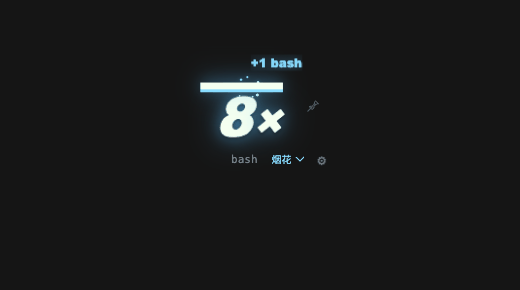

# dsh-combo

English | [简体中文](README.zh-CN.md)

A lightweight DeepSeek Harness (DSH) plugin that displays per-turn tool-call combos in DSH Web and DSH Desktop. Each committed `tool/call` adds one; the counter resets at a turn boundary.



## Features

- Reads the Host's `dshCombo` Session Projection. Tool results and unrelated events do not increment the count.
- Keeps the counter turn-based by default. Set `expireMs` to opt into an idle timeout.
- Shows the latest tool name, tiered visual feedback, optional sound, and a per-session pin that can carry a streak across turns.
- Runs in the DSH Web Client, including the Web UI embedded in DSH Desktop. It does not add content to model requests or contact a third-party service. Pin state is stored in the client page's `localStorage`.

## Install with the official CLI

This is an independent community plugin installed through the official `dsh plugin` CLI. It is not produced by DeepSeek. It ships runnable JavaScript with no install-time build scripts.

Install into the profile you use. Web and Desktop have separate profiles:

```sh
# DSH Web UI
dsh plugin --profile web add github:QuentinCrane/dsh-combo

# DSH Desktop
dsh plugin --profile desktop add github:QuentinCrane/dsh-combo
```

For DSH Desktop, launch the app once to initialize its profile, fully quit it, and run Desktop's bundled `dsh` command. If that command is not on your PATH, enable it through **Manage dsh Command** in the app first. Reopen Desktop after installation. See the [official Desktop guide](https://github.com/deepseek-ai/deepseek-harness/blob/master/apps/desktop/README.md#bundled-command-runtime).

To install a local checkout instead, use the path to the directory containing `package.json`:

```sh
dsh plugin --profile <profile> add link:/absolute/path/to/dsh-combo
```

Check that the bundle layer appears in the profile before launching:

```sh
dsh --profile web --dump-config
dsh --profile web
```

The plugin contributes a Host projection and a DSH Client module. DSH Desktop embeds the same Web application, so the module also runs there when installed into the `desktop` profile. DSH requires Client modules to declare `platform: web`; this describes the Client runtime contract and does not mean the plugin is limited to the standalone Web profile. After installing or changing package files, restart the profile unless its HMR setup has applied the change.

## Configure

The bundle provides working defaults in `cordis.patch.yml`. To override them, add a later row for `dsh-combo` in the profile's `cordis.patch.yml`:

```yaml
- id: dsh-combo
  config:
    enabled: true
    showToolName: true
    animation: normal
    particles: true
    preset: particles
    timerMs: 10000
    powerThreshold: 0
    effectFrequency: 1
    shake: true
    shakeIntensity: 3
    scale: 1
    offsetX: 18
    offsetY: 10
    barHeight: 7
    particleCount: 0
    particleSize: 4
    particleSpread: 1
    effectDurationMs: 820
    glow: 1
    accentColor: ''
    numberColor: ''
    showGain: true
    showTimer: true
    position: top-right
    excludeTools: []
    expireMs: 0
    sound: false
    soundVolume: 0.35
    soundFrom: 10
    pinPromptMs: 5000
```

DSH patch layers replace a row's complete `config` object. Include every setting you want to keep when overriding the row.

| Setting | Default | Meaning |
|---|---:|---|
| `enabled` | `true` | Show the HUD. |
| `showToolName` | `true` | Show the most recent tool below the counter. |
| `animation` | `normal` | `off`, `normal`, or `strong`; `strong` uses a larger pop. Reduced-motion preferences disable CSS animation. |
| `particles` | `true` | Emit the selected effect on each tool call while animation is enabled; particle density grows with the combo tier. |
| `preset` | `particles` | Default effect: `particles`, `flames`, `fireworks`, or `rift`. |
| `position` | `top-right` | `top-right`, `top-left`, `bottom-right`, or `bottom-left`. |
| `excludeTools` | `[]` | Tool names to ignore, matched without case sensitivity. |
| `expireMs` | `0` | Optional idle reset in milliseconds; `0` disables it. Maximum: `600000`. |
| `sound` | `false` | Play a short synthesized tone. |
| `soundVolume` | `0.35` | Tone volume from `0` to `1`. |
| `soundFrom` | `10` | First count that plays a tone. Range: `0` to `1000`. |
| `pinPromptMs` | `5000` | How long a finished run of at least two calls remains available to pin. Maximum: `60000`; `0` disables the prompt. |

Invalid enum values use their defaults; numeric settings are clamped to their documented ranges.

## Display behavior

| Count | Display |
|---|---|
| 1–9 | White multiplier, bright top bar, green glow and square particles |
| 10–19 | Larger multiplier, yellow-green glow and more particles |
| 20–49 | Yellow glow, slight shake and denser particles |
| 50+ | Orange glow, largest multiplier and densest particles |

The unboxed PowerMode-style meter displays a bold multiplier beneath a bright bar. Use the selector below it to switch between particles, flames, fireworks and rift; switching previews the effect without changing the count. Your choice is saved locally and overrides the configured default `preset`. Flames use orange, fireworks blue and rift purple.

The 📌 button keeps the current run as a streak for that Session. When an unpinned turn ends, a run of at least two calls stays dimmed for `pinPromptMs`; pin it during that window to continue counting across turns. Pin state survives a page reload in local storage.

## Appearance and rhythm

Use the gear beside the meter to edit appearance, timing and effects immediately. Preferences are saved locally; Reset clears local overrides and restores the configured defaults.

The countdown alone does not reset the per-turn count. For PowerMode-style idle resets, set `expireMs` in the profile configuration. Unpinned runs then use the same duration for the countdown. Pinned streaks remain preserved across turns.

| Option | Default | Range | Description |
|---|---|---|---|
| `timerMs` | `10000` | 1000–60000 ms | Countdown duration; refills on each call. Unpinned idle-reset runs use `expireMs` instead. |
| `powerThreshold` | `0` | 0–1000 | Combo needed to activate feedback and effects. |
| `effectFrequency` | `1` | 1–20 | Calls per burst; batches crossing a trigger boundary also emit. |
| `shake` | `true` | boolean | Independent combo-shake switch. |
| `shakeIntensity` | `3` | 0–12 px | Shake amplitude. |
| `scale` | `1` | 0.5–2 | Scale the meter and its particles. |
| `offsetX` | `18` | 0–240 px | Horizontal edge offset. |
| `offsetY` | `10` | 0–240 px | Vertical edge offset, clearing window chrome at the top. |
| `barHeight` | `7` | 2–16 px | Countdown bar height. |
| `particleCount` | `0` | 0–80 | Particles per burst; `0` automatically scales with combo tiers. |
| `particleSize` | `4` | 1–12 px | Particle size. |
| `particleSpread` | `1` | 0.25–2 | Spread multiplier. |
| `effectDurationMs` | `820` | 200–2500 ms | Burst animation duration. |
| `glow` | `1` | 0–2 | Glow strength; `0` turns it off. |
| `accentColor` | `''` | #RRGGBB or empty | Override glow and particle color; empty uses preset colors. |
| `numberColor` | `''` | #RRGGBB or empty | Override the number and bar color; empty follows the UI theme. |
| `showGain` | `true` | boolean | Display the floating `+N` gain. |
| `showTimer` | `true` | boolean | Display the countdown bar. |

Inspired by [VS Code PowerMode](https://github.com/hoovercj/vscode-power-mode): remaining time expresses rhythm, threshold and frequency control feedback, and presets combine with independent customization. This implementation uses CSS animations and DSH session projections, with tool calls driving feedback.

## Repository layout

```text
dsh-combo/
├── index.js              # Host Session Projection and config route
├── client.js             # DSH Client module and overlay HUD
├── cordis.patch.yml      # Installable DSH bundle layer
├── package.json          # Bundle and Client module manifests
├── test/                 # Host and Client unit tests with local runtime shims
├── docs/                 # Development and troubleshooting notes
├── README.md
├── README.zh-CN.md
├── CONTRIBUTING.md
├── CHANGELOG.md
└── LICENSE
```

## Development

Run the local unit suite with:

```sh
npm test
```

The Client reads the active binding from `uiSession.adapter.current` and subscribes to `sessions.binding(id).session.projections.faceOf('dshCombo')`. The Host owns the fold over committed Session events. `dsh.client.inject` lists package relationships; the Client plugin's exported Cordis `inject` list declares the runtime services it waits for.

For the public bundle and Client contracts, see the [DSH plugin publishing guide](https://github.com/deepseek-ai/deepseek-harness/blob/master/docs/user/develop/basic/publish.md), [Client Modules reference](https://deepseek-harness.github.io/deepseek-harness/en/reference/subsystems/client-modules), [Session Projections reference](https://deepseek-harness.github.io/deepseek-harness/en/reference/subsystems/session-projection), [official Client package rules](https://github.com/deepseek-ai/deepseek-harness/blob/master/packages/client/AGENTS.md), and [Desktop guide](https://github.com/deepseek-ai/deepseek-harness/blob/master/apps/desktop/README.md). DSH is in developer preview and may introduce breaking API changes.

For GitHub discoverability, add the `dsh-plugin` topic to the repository.
